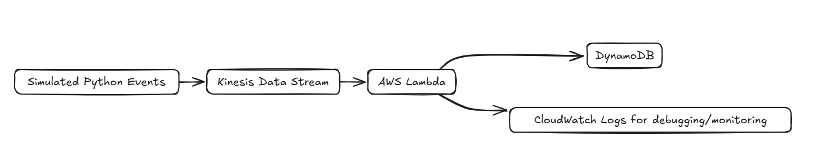
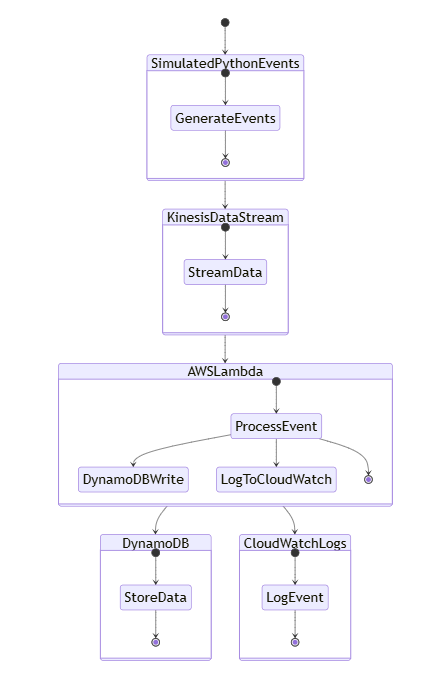
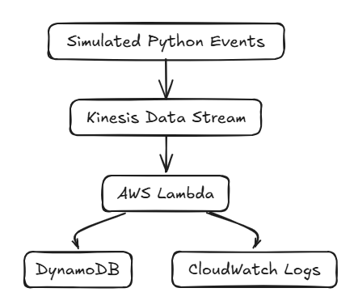
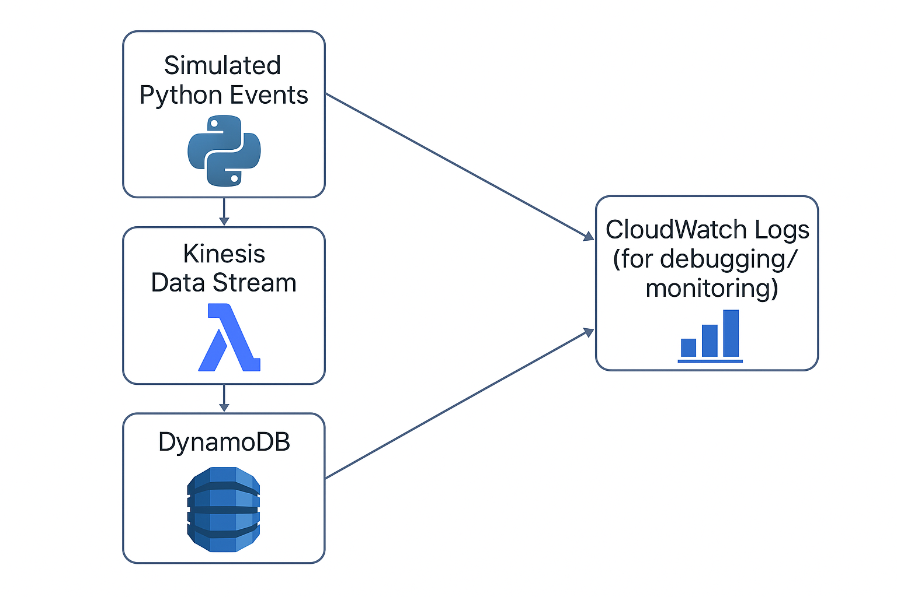

# streamline_kinesis_lambda_dynamodb

## 🧪 Use Case

> This project can be adapted for use cases such as real-time analytics, clickstream tracking, IoT event ingestion, or log processing pipelines.

- **Simulated Events**: A Python script continuously pushes random event data into a Kinesis stream.
- **Kinesis Data Stream**: Captures streaming data and triggers a Lambda function.
- **AWS Lambda**: Processes each event and stores it in a DynamoDB table.
- **DynamoDB**: Serves as the persistent storage layer for processed events.
- **CloudWatch Logs**: Monitors the Lambda execution for debugging and observability.

---

## 🛠 Technologies Used

- **Python** for simulation and Lambda function
- **AWS Kinesis** for real-time data ingestion
- **AWS Lambda** for serverless processing
- **AWS DynamoDB** for persistent event storage
- **AWS CloudWatch** for monitoring and logs

**Simulated Python Events → Kinesis Data Stream → AWS Lambda → DynamoDB**  
                            ↘︎  
                             CloudWatch Logs (for debugging/monitoring)

## 🖼 Workflow Diagrams

Visual representations of the end-to-end system:

### Simple Flow

### Detailed Flow

### Lambda Trigger Architecture

### Full System Diagram
